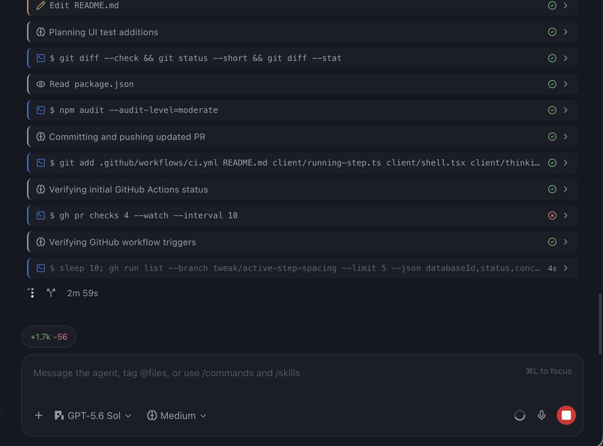

# Beautiful Pi

A compact, polished timeline renderer for Pi agents in Paseo.



The first MVP replaces Paseo reasoning rows with a compact, recognizable thinking card while preserving paced streaming. It includes:

- a Brain icon with the current reasoning activity shown directly
- clean plain text with Pi's `**` markers removed
- restrained accent, surface, and typography treatment
- collapsed one-line shell command previews with wrapped commands and output when expanded
- matching collapsed cards for every tool call, including read, write, edit, search, fetch, sub-agent, and custom skill tools
- tap-to-expand code, inline diffs, logs, and tool details
- elapsed timers and pulsing activity text for running steps
- collapsed-by-default reasoning and shell sections with tap-to-expand history
- a neutral reasoning rail and theme-accented shell activity
- light, dark, desktop, and compact layouts through Paseo theme tokens

## Development

```sh
npm install
npm run check
```

## Try it locally

Plugins are trusted, unsandboxed code. After inspecting the source and enabling plugins in Paseo, install the checkout on the daemon host:

```sh
paseo plugin install /absolute/path/to/beautiful-pi
```

Then run a Pi agent turn that produces reasoning. Beautiful Pi transforms it from the first streaming delta and renders the completed history with the same component.

## Compatibility

- Paseo `>=0.8.0 <1.0.0`
